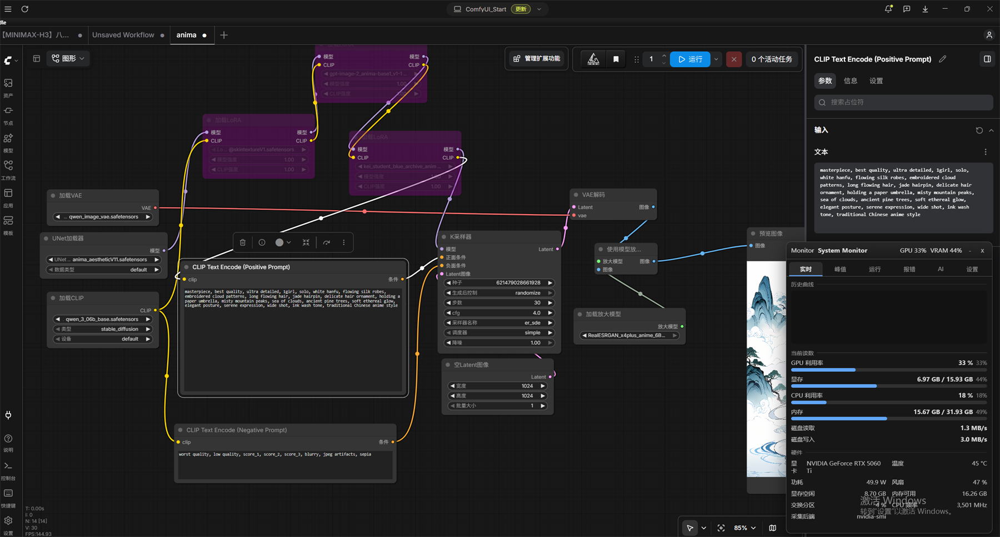
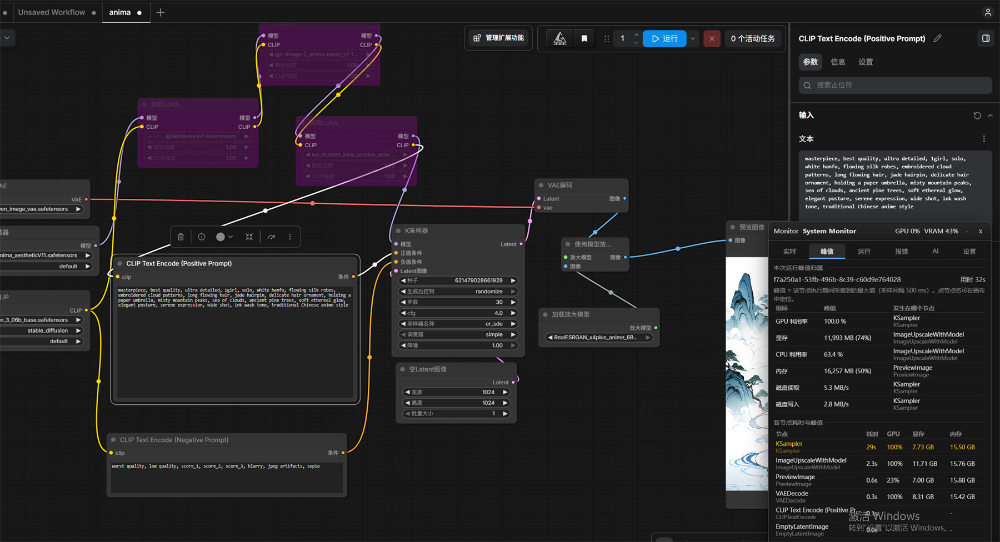
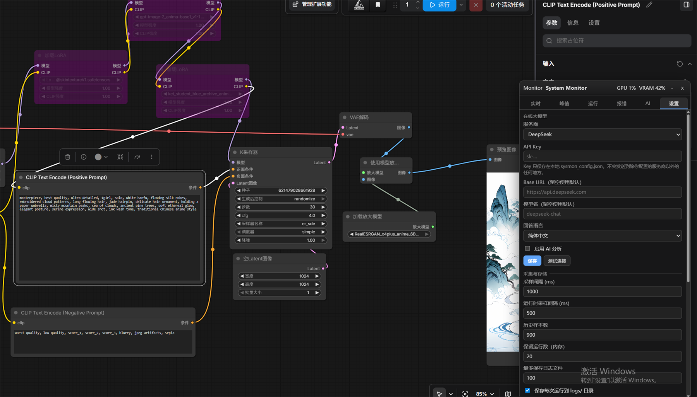

# ComfyUI System Monitor

**让 ComfyUI 的每一次卡顿都有据可查。**

实时监控 GPU / 显存 / CPU / 内存 / 磁盘，并把每一次运行的最高峰值**精确归因到具体的节点**；
自动记录运行时长、保存报错堆栈；可选接入在线大模型（DeepSeek 或任意 OpenAI 兼容接口）
对运行状态和报错做诊断与优化建议。

A ComfyUI custom node pack that shows live GPU/VRAM/CPU/RAM/disk metrics, attributes
each run's peak usage **to the node that caused it**, logs durations and tracebacks,
and can hand a run to an online LLM for diagnosis.

---

## 它解决什么问题

ComfyUI 跑图时你通常只知道"很慢"或"爆显存了"，但不知道**是哪个节点**造成的。
System Monitor 把硬件采样与节点执行窗口对齐，直接告诉你：

```
显存峰值   15,512 MB (95.1%)  →  #2  Heavy Blur
CPU  峰值      67.7 %         →  #2  Heavy Blur
耗时最长        1.760 s        →  #2  Heavy Blur
```

---

## 实际效果

### 实时监控 + 历史曲线

GPU / 显存 / CPU / 内存归一化后同图对比，右侧是当前读数与硬件详情。
下面是真实运行 anima 工作流时的画面：



### 峰值归因（核心功能）

每一次运行结束后，每个指标的最高峰出现在哪个节点一目了然；
下方还给出各节点的耗时与峰值明细，耗时最长的节点会被高亮。



例如上面这次运行（32 秒）：GPU 利用率峰值 100% 出现在 `KSampler`，
显存峰值 11.4 GB 出现在 `ImageUpscaleWithModel`，CPU 峰值 63.4% 同样在 `ImageUpscaleWithModel`。

### 设置页：在线大模型与采样参数

DeepSeek 开箱即用，也可以填任意 OpenAI 兼容接口的 Base URL 与模型名；
API Key 只保存在本地，界面上始终以掩码显示。



---

## 功能

| 功能 | 说明 |
|---|---|
| **实时监控** | GPU 利用率、显存、温度、功耗、风扇、频率；CPU、内存、交换分区；磁盘读写速率。1 秒一次采样。 |
| **历史曲线** | GPU / CPU / 显存 / 内存归一化后同图对比，最多保留 900 个采样点。 |
| **峰值归因** | 每次运行记录每个节点的耗时与峰值，并标明每个指标的最高峰发生在哪个节点。点击节点名可在画布中定位。 |
| **运行历史** | 最近 20 次运行的时长、状态、峰值、逐节点明细，可展开查看。 |
| **报错捕获** | 完整堆栈、异常类型、出错节点及其输入摘要；失败时额外保存一份带硬件时间线的详细快照。 |
| **持久化** | 每次运行写入 `logs/*.json`，自动按数量滚动清理。 |
| **AI 诊断** | 一键把"报错 + 运行指标 + 节点列表"发给在线大模型，返回瓶颈分析与优化建议；支持追问。 |
| **零依赖** | 只用 ComfyUI 自带的 `psutil` 与标准库，**无需 pip 安装任何东西**。 |

---

## 安装

把整个文件夹放进 ComfyUI 的 `custom_nodes` 目录，然后重启 ComfyUI：

```bash
cd ComfyUI/custom_nodes
git clone https://github.com/twrsm666/comfyui-sysmon.git
```

重启后右下角会出现悬浮面板。若没看到，请按 `F5` 强制刷新一次浏览器缓存。

**要求**：ComfyUI ≥ 0.3.x、Python ≥ 3.9。GPU 数据需要 NVIDIA 驱动（`nvidia-smi` 或
`nvidia-ml-py`），没有独显时其他指标照常工作。

---

## 使用

### 悬浮面板

右下角面板分成六个标签页：

- **实时** — 当前读数与历史曲线
- **峰值** — 本次运行各指标的最高峰分别发生在哪个节点
- **运行** — 最近若干次运行的完整记录
- **报错** — 捕获到的报错与堆栈
- **AI** — 大模型诊断
- **设置** — 采样间隔、存储策略、告警阈值、大模型配置

面板可拖动、可折叠、可关闭（关闭后右下角留一个小胶囊按钮）。
位置、折叠状态、当前标签页都会记住。

### 配置在线大模型

1. 打开 **设置** 标签页
2. 选服务商（`DeepSeek` 或 `OpenAI Compatible`）
3. 填入 API Key
4. 点 **测试连接** 确认可用

DeepSeek 直接用默认值即可。其他服务（通义、Kimi、硅基流动、OpenRouter、本地 Ollama 等）
选 `OpenAI Compatible`，填 Base URL 与模型名。也可以改用环境变量
`DEEPSEEK_API_KEY` / `OPENAI_API_KEY`，此时无需在界面里填 Key。

**隐私**：点"AI 分析"时只会发送**报错信息、运行指标、节点类型与标题**。
不会发送图片、提示词正文、模型输出或任何模型文件。发送前可以点
**查看将要发送的数据** 逐字确认。

### 可选节点

`System Monitor (Report)` 节点把当前指标接入工作流，输出
`gpu_percent / vram_mb / cpu_percent / ram_percent / text`，
可以用来给文件命名或按显存压力分支。

---

## 配置项

设置保存在插件目录的 `sysmon_config.json`（首次修改时自动创建），也可以直接编辑。

| 键 | 默认 | 说明 |
|---|---|---|
| `sample_interval_ms` | `1000` | 空闲时采样间隔 |
| `sample_interval_active_ms` | `500` | 运行中采样间隔（越小归因越准，开销越大） |
| `history_size` | `900` | 内存中保留的采样点数 |
| `history_runs` | `20` | 内存中保留的运行次数 |
| `save_runs` | `true` | 是否把每次运行写入 `logs/` |
| `max_saved_runs` | `100` | 日志文件数量上限，超出后删除最旧的 |
| `save_error_artifacts` | `true` | 失败时额外保存详细快照 |
| `disk_path` | `""` | 只统计该路径所在磁盘；留空统计全部磁盘 |
| `gpu_index` | `null` | 多卡时选择显卡序号 |
| `warn_vram_percent` / `crit_vram_percent` | `85` / `95` | 显存告警阈值 |
| `warn_ram_percent` / `crit_ram_percent` | `85` / `95` | 内存告警阈值 |
| `llm_provider` | `"deepseek"` | `deepseek` \| `openai_compatible` |
| `llm_api_key` | `""` | API Key（本地明文保存，注意不要提交到 git） |
| `llm_base_url` / `llm_model` | `""` | 留空使用服务商默认值 |
| `llm_language` | `"zh"` | 建议语言 `zh` \| `en` |

---

## HTTP 接口

面板之外也可以直接调用（同时支持带 `/api` 前缀的形式）：

| 方法 | 路径 | 说明 |
|---|---|---|
| GET | `/sysmon/state` | 最新采样 + 当前运行 + 配置 |
| GET | `/sysmon/series?limit=240` | 历史采样序列 |
| GET | `/sysmon/runs?limit=10` | 运行历史 |
| GET | `/sysmon/run/{prompt_id}` | 单次运行详情（`?timeline=1` 附带硬件时间线） |
| GET | `/sysmon/errors?limit=20` | 报错记录 |
| GET | `/sysmon/context` | 预览将发送给大模型的数据 |
| GET/POST | `/sysmon/config` | 读取 / 修改配置 |
| POST | `/sysmon/analyze` | 触发 AI 分析 |
| POST | `/sysmon/test_llm` | 测试大模型连通性 |
| DELETE | `/sysmon/runs` | 清空内存中的运行历史 |

---

## 关于"峰值归因"的精度

节点峰值 = 该节点执行期间采集到的最大值。因此：

- **采样间隔决定了归因下限**。默认运行中 500 ms 采样一次，比这更短的节点
  （例如 PreviewImage）可能一个采样点都没落在窗口内，此时该节点不显示峰值——
  这是真实的"太短了测不到"，而不是 bug。
- 想更精确就调小 `sample_interval_active_ms`（例如 200），代价是开销略增。
- 采样在独立后台线程进行，对生成速度的影响通常远小于 1%。

---

## 兼容性

已验证环境：

| | |
|---|---|
| ComfyUI | 0.32.0 |
| 前端 | comfyui-frontend-package 1.48.7 |
| Python | 3.13.12 |
| PyTorch | 2.10.0+cu130 |
| GPU | NVIDIA RTX 5060 Ti 16 GB (驱动 591.86) |
| 系统 | Windows 11 |

实现上做了三层兼容处理：

1. **节点级事件**优先使用 ComfyUI 官方的 `ProgressRegistry` / `ProgressHandler` 扩展点。
2. 若该 API 不存在（较老的 ComfyUI），自动回退到监听 `executing` / `executed`
   websocket 消息。
3. **GPU 后端**依次尝试 `pynvml` → `nvidia-smi` → `torch.cuda`，逐级降级；
   全部失败时其余指标仍然正常工作。
4. 所有钩子都包了异常保护——**本插件的任何 bug 都不会中断你的生成任务**。

---

## 开发

```bash
# 后端单元测试（无需启动 ComfyUI，直接在 ComfyUI 的 venv 里跑）
python tests/run_tests.py

# HTTP 接口测试（真实 aiohttp 测试服务器 + 本地 mock 大模型端点）
python tests/api_tests.py

# 节点测试（SystemMonitorReport 的注册信息与行为，含异常兜底）
python tests/node_tests.py

# 前端静态检查（语法、重复声明、相对导入、调用未定义的函数）
node tests/check_web.mjs
```

后端测试覆盖：`nvidia-smi` 输出解析、真实硬件采样、环形缓冲与时间窗切片、
峰值提取、逐节点归因（含缓存节点跳过、节点重入、失败收尾）、
节点身份解析（标题 vs class_type，含子图与缺失节点）、
报错记录与持久化、LLM 上下文构建与隐私边界、配置掩码与容错、
针对本地 mock 服务端的**完整 LLM 请求/响应往返**、
**LLM 各类失败路径**（401/402/429/404、非 JSON 响应、网络不可达）、
以及 **API Key 泄露回归测试**（断言 Key 不出现在任何配置视图、运行记录、
报错载荷与日志文件中）。

接口测试覆盖全部 `/sysmon/*` 路由的参数解析、状态码、JSON 结构、掩码与错误路径，
并通过本地 mock 端点走通 `/test_llm` 与 `/analyze` 的完整链路，
另含 **AI 开关的同意门禁**（关闭时拒绝分析且不发出任何请求）。

节点测试确保 `SystemMonitorReport` 在监控未启动、内部异常等情况下
仍然返回合法元组，绝不中断用户的生成任务。

前端检查能抓出两类只在用户点击时才暴露的问题：加载期语法/重复声明错误，
以及**调用了未定义的辅助函数**（`checkRow()` 曾经就是这样漏掉的）。

### 用真实服务商验证大模型路径

默认全部离线。设置以下环境变量后，测试会真的调用在线服务商，
从而验证**成功返回**这条唯一无法用 mock 覆盖的链路：

```bash
# Windows PowerShell
$env:SYSMON_LIVE_API_KEY = "sk-你的key"
python tests/run_tests.py          # 会额外执行一次真实请求

# 可选：换服务商 / 模型
$env:SYSMON_LIVE_BASE_URL = "https://api.deepseek.com"
$env:SYSMON_LIVE_MODEL    = "deepseek-chat"
```

---

## 目录结构

```
comfyui-sysmon/
├── __init__.py           # ComfyUI 入口：注册节点、延迟启动、WEB_DIRECTORY
├── sysmon/
│   ├── config.py         # 配置持久化与掩码
│   ├── metrics.py        # 硬件采样（三层 GPU 后端 + 峰值提取）
│   ├── store.py          # 运行记录、归因、报错、落盘
│   ├── hooks.py          # ComfyUI 执行钩子（进度注册表 / 传统回退）
│   ├── llm.py            # 上下文构建与在线大模型调用（纯标准库）
│   └── api.py            # /sysmon/* HTTP 路由
├── web/
│   ├── panel.js          # 悬浮面板（扩展注册 + 六个标签页）
│   ├── chart.js          # 无依赖 canvas 折线图
│   └── sysmon.css        # 样式（全部限定在 #sysmon-panel 下）
├── tests/
│   ├── run_tests.py      # 后端测试（141 项断言）
│   ├── api_tests.py      # HTTP 接口测试（64 项断言）
│   ├── node_tests.py     # 节点测试（28 项断言）
│   └── check_web.mjs     # 前端静态检查
├── scripts/
│   └── publish.ps1       # 发布前自检 + 一键提交推送
├── docs/
│   └── PUBLISHING.md     # 发布到 GitHub 的完整步骤
├── CHANGELOG.md
├── pyproject.toml        # ComfyUI Registry / 打包元数据
├── LICENSE               # MIT
└── logs/                 # 运行记录（自动创建，已被 .gitignore 忽略）
```

---

## 发布前自检

`scripts/publish.ps1` 会在任何东西离开本机之前做四项检查：

1. `git` 是否可用
2. `.gitignore` 是否确实排除了 `sysmon_config.json`（含 API Key）与 `logs/`
3. 源码里是否存在**真实样式**的 API Key
   （测试用的假 Key 会被识别并忽略，不会误报——已用真实样式字符串做过反向验证）
4. 后端测试与前端静态检查是否通过

```powershell
# 只做检查，不提交任何东西
.\scripts\publish.ps1

# 检查通过后提交并推送
.\scripts\publish.ps1 -RepoUrl https://github.com/twrsm666/comfyui-sysmon.git

# 或者让 GitHub CLI 直接建仓并推送
.\scripts\publish.ps1 -UseGhCli
```

详见 [docs/PUBLISHING.md](docs/PUBLISHING.md)。

---

## License

MIT — 见 [LICENSE](LICENSE)。
